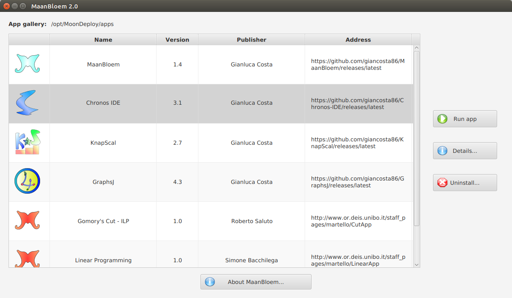

# MaanBloem

*App manager for MoonDeploy*

## Introduction

[MoonDeploy](http://gianlucacosta.info/MoonDeploy) is a lightweight tool for software deployment: in particular, users can manage their app gallery using their favorite file explorer.

**MaanBloem** is a simple ScalaFX application simplifying app management even further:

* It automatically scans the app gallery, finding and listing every installed app

* It can show additional details about each app

* Quick & easy app removal - via the *Uninstall...* button

## Requirements

In order to start MaanBloem, **Java 8u65** or later compatible is recommended

## Running the app

MaanBloem is a [MoonDeploy](http://gianlucacosta.info/MoonDeploy) app, too! ^\_\_^

Therefore, the suggested way to run the app consists in downloading its **.moondeploy** descriptor from the [release area](https://github.com/giancosta86/MaanBloem/releases/latest) and opening it with MoonDeploy.

Alternatively, you might want to download the binary zip and execute one of the scripts in the **bin** subdirectory.

## About the name

*MaanBloem* is a Dutch term meaning *moon flower* - a poetic reference to [MoonDeploy](http://gianlucacosta.info/MoonDeploy).

## Special thanks

The icons in the buttons are part of the [Crystal Clear icon set](https://commons.wikimedia.org/wiki/Crystal_Clear), by [Everaldo Coelho](https://en.wikipedia.org/wiki/Everaldo_Coelho).

## Further references

* [MoonDeploy](http://gianlucacosta.info/MoonDeploy)
